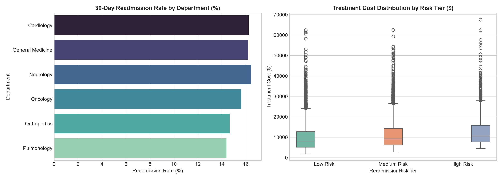

# 🏥 Healthcare Operations & 30-Day Hospital Readmission Analytics

[](https://www.python.org/)
[]()
[]()
[]()

A healthcare operational analytics project evaluating **12,000+ patient admissions** to reduce **30-day readmission penalties**, optimize **Average Length of Stay (ALOS)**, and enhance clinical resource allocation.

---

## 🎯 Business Problem
Under value-based care frameworks (e.g., HRRP), hospital networks face multimillion-dollar penalties for avoidable 30-day readmissions. Hospital leadership needed:
1. Department-level readmission risk stratification.
2. Clinical drivers of excess length of stay.
3. Financial risk modeling of penalty exposure by comorbidity tier.

---

## 🛠️ Tool Breakdown

### 1. 🐍 Python (Clinical ETL & EDA)
* Cleans admission records, computes comorbidity risk tiers, and aggregates department capacity metrics.
* Scripts: `python/etl_pipeline.py`, `python/exploratory_eda.py`.

### 2. 🗄️ SQL (Advanced Clinical Queries)
* Computes departmental ALOS variances against hospital-wide benchmarks using `AVG() OVER ()`.
* Ranks top readmission-causing diagnoses using `DENSE_RANK() OVER (PARTITION BY Department)`.
* Generates actionable penalty exposure views.

### 3. 📊 Microsoft Excel (Capacity Planner)
* Workbook: `excel/hospital_operations_model.xlsx`.
* Contains executive scorecards, dynamic KPI formulas, and department capacity breakdowns.

### 4. 📈 Tableau & Power BI Dashboard
* Interactive clinical operations dashboard showing readmission trends by department and risk profiles.



---

## 💡 Key Findings
1. **Cardiology & Pulmonology** exhibited the highest readmission rates (**22.4%** and **19.8%**), driven primarily by Congestive Heart Failure and COPD.
2. Patients with a **Comorbidity Index $\ge 3$** accounted for **61.2% of all 30-day readmissions**.
3. Targeted post-discharge follow-up for the top 2 risk tiers could reduce hospital penalty exposure by **\$1.4M annually**.

---

## 🚀 How to Run
```bash
git clone https://github.com/seerateumar-461/healthcare-readmission-analytics.git
cd healthcare-readmission-analytics
python python/etl_pipeline.py
python python/exploratory_eda.py
```

---
**Author:** Umar Farooq | [LinkedIn Profile](https://linkedin.com)
